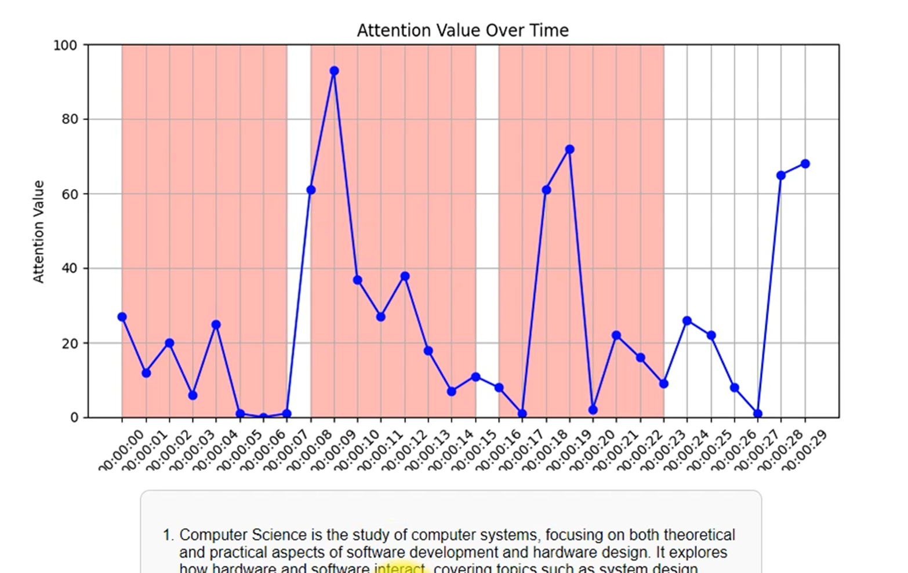

# 프로젝트 이름
사용자의 집중을 돕는 임베디드 시스템 - Attention Supporter

## 📝 프로젝트 개요
이 프로젝트는 EEG 센서와 Raspberry Pi를 활용하여 사용자의 집중 상태를 모니터링하고, 학습 효율을 높이기 위한 경고 및 피드백 시스템을 제공합니다.

---

## 🌟 주요 기능
1. **집중도 분석**:
   - EEG 센서를 통해 사용자의 집중 점수를 수집 (0~100 범위).
   - 집중 점수가 50 미만으로 유지되는 저하 구간 탐지.

2. **경고 알림 시스템**:
   - 집중 저하 구간(50 미만, 연속 8초 이상)에 경고 알림 제공.

3. **데이터 시각화**:
   - 시간대별 집중 점수를 그래프로 시각화.
   - 저하된 구간을 강조 표시.

4. **학습 보조 기능**:
   - 입력된 텍스트에서 공백 문제 생성 및 제공.

---

## 🚀 설치 및 실행 방법

### 1. **필수 요구사항**
- Python 3.8 이상
- Flask
- Pandas
- Matplotlib
- KeyBERT
- EEG 센서 모듈 및 Raspberry Pi

### 2. **설치**
```bash
# 저장소 클론
git clone https://github.com/사용자명/프로젝트명.git
cd 프로젝트명

# 가상환경 생성 및 활성화 (선택 사항)
python -m venv venv
source venv/bin/activate  # Linux/MacOS
venv\Scripts\activate     # Windows

# 필수 라이브러리 설치
pip install -r requirements.txt
